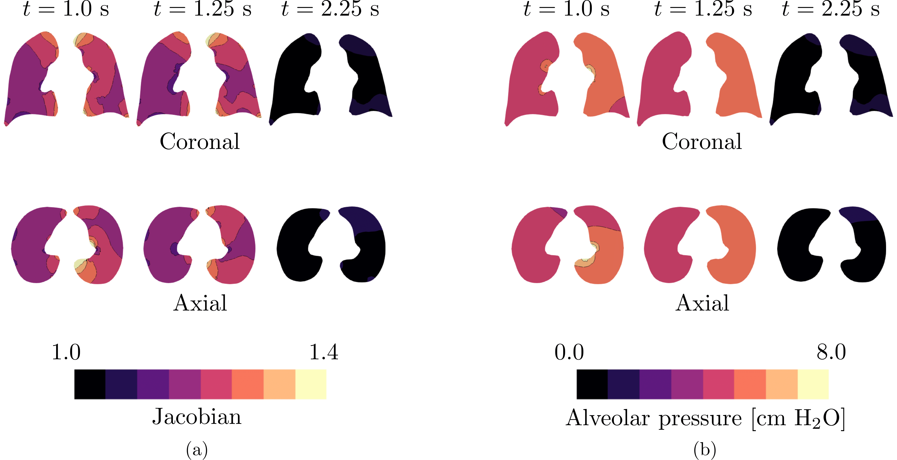
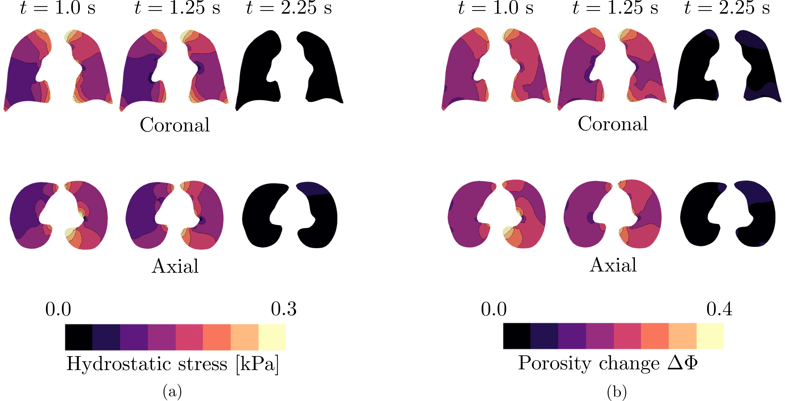
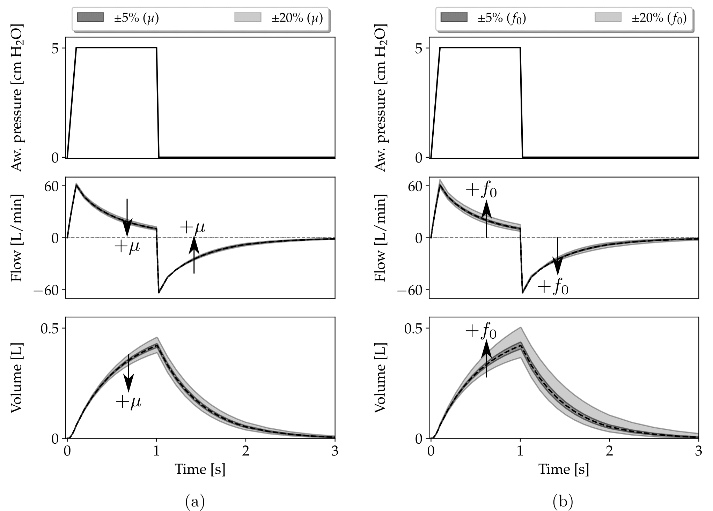
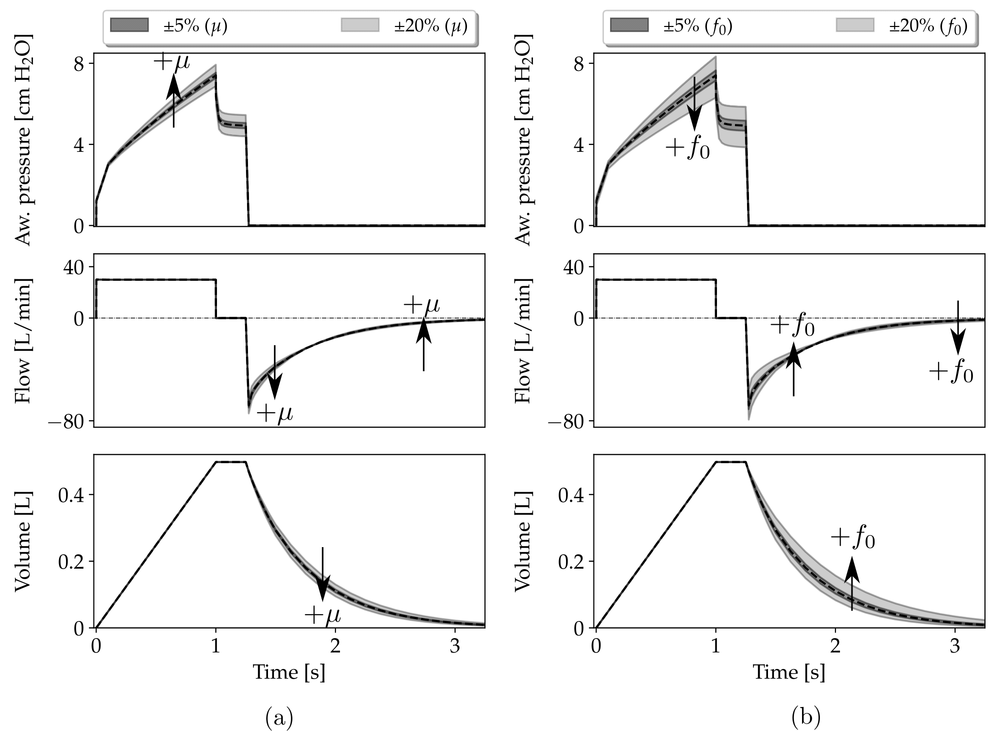
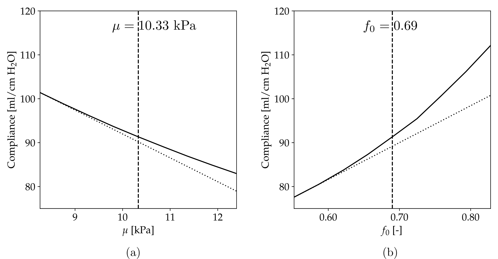

# Multiscale modeling of lung mechanics: from alveolar microstructure to pulmonary function

Contact: 
_[@dehurtado](https://github.com/dehurtado)_
_[@comp-medicine-uc](https://github.com/comp-medicine-uc)_

Multiscale poroelastic lung model: influence of microstructural parameters on pulmonary function. 

## Abstract

The mechanical behavior of the lungs has long been associated with the structural properties of alveoli in pulmonary medicine. However, this structure-function relationship has mostly been qualitative, as experimentation in real lungs is costly and limited by ethical standards. Here we present a poromechanical multiscale model that connects key alveolar features with organ-level function. To this end, we first revisit an asymptotic homogenization framework for finite-deformation poromechanics and formulate fine-scale and coarse-scale problems that govern lung mechanics. We further inform the coarse-scale problem using a tetrakaidecahedron micromechanical model for the alveolar response at the fine scale that strongly depends on the alveolar-wall elastic modulus and the initial alveolar porosity. Based on this formulation, we construct a non-linear finite element model from anatomical geometries to simulate the response of human lungs connected to a mechanical ventilator under pressure-controlled and volume-controlled protocols. We show that the predicted signals for airway pressure, airway flow, and lung volume capture the dynamic waveform characteristics observed in human lungs. Further, we demonstrate that lung behavior, measured in terms of respiratory-system compliance, strongly depends on the alveolar-wall elasticity and alveolar porosity. In particular, we show that variations in these microstructural parameters result in marked changes in compliance that follow the structure-function relations observed in lungs with pulmonary fibrosis and emphysema, two prevalent chronic respiratory diseases. We envision that our multiscale lung model can enhance current {\it in silico} efforts to experimentation in respiratory research and provide a computational framework for clinically-relevant simulations.  

## Results

The main results of this research are shown below. The spatiotemporal evolution of the jacobian and the alveolar pressure fields for the VCV baseline case are shown in Figure 3. We report three key time instants observed in a VCV mode cycle: the end of inspiration ($t_1=1.0$ s), the end of the inspiratory pause ($t_2=1.25$ s), and when half expiration has elapsed ($t_3= 2.25$ s).

<figure>

</figure>
Figure 3. Temporal evolution during one respiratory cycle of volume-controlled
mechanical ventilation in the baseline case: (a) jacobian field, and (b) alveolar pressure field. Fields are plotted on the current configuration.
    

Figure 4 shows the spatiotemporal evolution of the hydrostatic stress and material porosity change fields. 
<figure>

</figure>
Figure 4. Temporal evolution during one respiratory cycle of volume-controlled
mechanical ventilation in the  baseline case: (a) hydrostatic stress field, and (b) material porosity change field. Fields are plotted on the current configuration
    

The airway pressure, flow, and lung volume signals were computed from the lung simulations for all the cases studied. Figure 5 shows these signals for the case of PCV mode, along with function envelopes that represent the variation of these signals for different levels of variation in the alveolar-wall elasticity and initial alveolar porosity.

<figure>

</figure>
Figure 5. Respiratory signals and parameter sensitivity analysis for pressure-controlled mechanical ventilation: a) variations in the alveolar-wall elasticity, and b) variations in the initial alveolar porosity.  Plots show the time evolution of airway pressure (top), flow (middle), and volume (bottom).
    

Respiratory mechanics curves for the case of the VCV mode are shown in Figure 6. 

<figure>

</figure>
Figure 6. Respiratory signals and parameter sensitivity analysis for volume-controlled mechanical ventilation: a) variations in the alveolar-wall elasticity, and b) variations in the initial alveolar porosity.  Plots show the time evolution of airway pressure (top), flow (middle), and volume (bottom).
    

To assess the dependence of lung mechanical parameters on microstructural features, we computed the respiratory-system compliance resulting from simulations that considered a range of values of the alveolar-wall elasticity and initial alveolar porosity, see Figure 7(a) and Figure7(b), respectively.

<figure>

</figure>
Figure 7. Parameter sensitivity analysis for the respiratory system compliance: a) influence of variations in the alveolar-wall elasticity $\mu$, and b) influence of variations in the initial alveolar porosity $f_0$. Baseline values of both parameters are indicated with a vertical dashed line. Dotted lines are included to visually assess the degree of non-linearity.
    

    

## Directories

- `manuscript`: Files pertaining to the article related to this project.
- `presentations`: Files pertaining to presentations of this project.
- `raw-data`: Input data needed for simulations + Output raw data.
- `results-data`: Data processed from `raw-data`.
- `src`: Source files.
- `tests`: Main files that implement examples and tests.

## Dependencies

Coded in Python 3.8.2 64-bit. 

Used libraries:

- [`FEniCS`](https://fenicsproject.org/) 2019.1.0
- `CGAL`
- `numpy`
- `scipy`
- `matplotlib`
- `os`
- `meshio` 4.4.6
- `nibabel`
- `pyvista`
